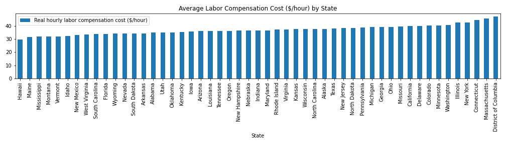
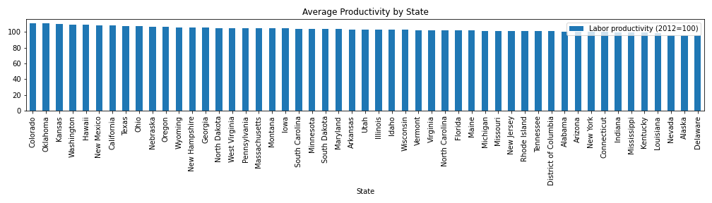
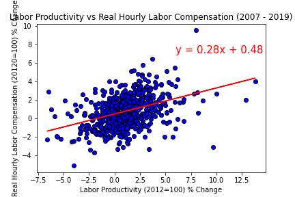
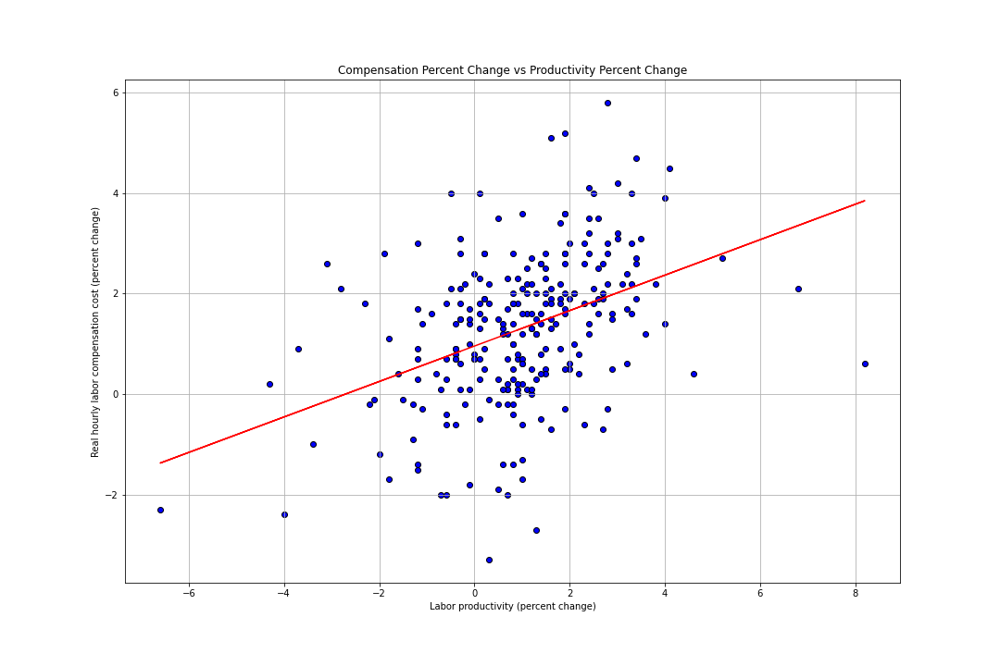
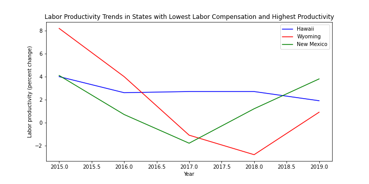
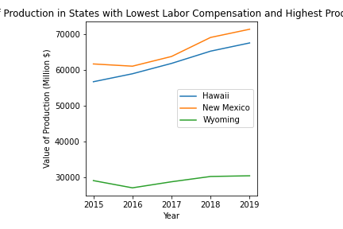
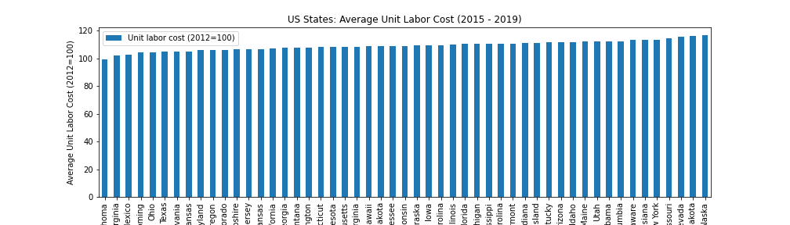

# bootcamp-project-1

Acme Corp Data Analyst Team
- Blake Ashford, Courtney Robison, Ryan Simpson, Lucienne Kaplan, Savannah Cordry

We are the Acme Corp Data Analyst Team and have been hired by Coyote Inc to help them find a location
for their newest factory.  We have been tasked with finding a location with the cheapest labor with the
best productivity output. We're analysing the Labor and Productivity data from the U.S. Bureau of 
Labor Statistics looking at the last five years of data (2014-2019). 

We will determine the top 3 states in the US which meet Coyote Inc's labor and productivity requirements. Then we will provide additional data on those states according to Coyote Inc's other criteria. 

# Findings
## Lowest Compensation
We found this by grouping our data by the states and grabbing the average labor compensation across all 50 states, which can be seen in the following graph:

## Highest Productivity
Finding the highest productivity was similar to finding the lowest compensation, except we grabbed the average productivity instead of compensation.

## States in Common
To find the states in common we had to expand our search to the top 15 states in each category. This is because there is a weak correlation between the two factors, the correlation being .41 in the last 5 years and .39 overall, which can be seen in the following charts:

The States we found in common were Hawaii, New Mexico, and Wyoming.

## Which is best?
To start off with we looked at the productivity trends in the three states to find which were trending up

Then we looked at the values of production in each state

With those two we have a clear winner in New Mexico but we also wanted to verify by looking at the unit labor cost

In this we see that New Mexico has the third lowest unit labor cost of all 50 states.

## In conclusion
Given the data collected above we have chosen New Mexico to build Coyote Inc's new facility.
